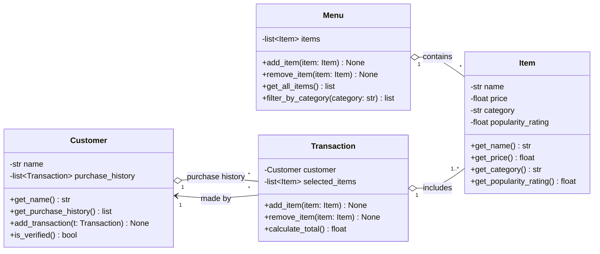

# ByteBites Design

## About This Project
You are building the backend logic for a campus food ordering app called ByteBites
using Python classes and simple algorithms.

## Project Scope
Do not add authentication logic, a database layer, or any features not described
in the spec.

## Behavioral Instructions
The AI assistant should keep the project relatively simple but think a lot about usability and features we might need.
Stay within the four base classes described in bytebites_spec.md

### Additions
- **Four classes only.** `Customer`, `Item`, `Menu`, `Transaction`. No helper classes (no `Category` class, `OrderLine`, `User`, etc.). Use plain strings, lists and dicts instead. If a fifth class seems necessary, propose it in chat and wait for approval.
- **Simple Python.** Plain classes, type hints and docstrings. Avoid inheritance, abstract classes, decorators, async code and third-party dependencies unless asked.
- **Suggest, don't sprawl.** Point out usability gaps (e.g. quantity, price changes, empty orders), but list them as suggestions rather than implementing them unasked.
- **Validate inputs.** Reject negative prices, empty names, and ratings outside the allowed range (0-5) with a clear `ValueError`.
- **Consistent categories.** Compare categories case-insensitively so "drinks" and "Drinks" match.
- **Small, testable methods.** Each method does one thing and returns a value instead of printing. Provide a few simple tests for each class.
- **Explain briefly.** When suggesting code, say what it does and why in a sentence or two, and show only the changed parts.
- **Ask when the spec is silent.** Do not guess at behavior the spec does not describe.

## Class Diagram
Paste into [mermaid.live](https://mermaid.live) to render.

## Design Notes
- **Category** is a plain string on `Item`, to stay within the four-class rule. `Menu.filter_by_category` handles case-insensitive matching.
- **Verification** is simple: `Customer.is_verified()` returns true when the customer has a name and at least one past transaction. No authentication logic.
- **Open question:** the spec has no quantity. For now, buying two burgers means adding the item twice. Worth confirming with the client.
- **Open question:** `Transaction` references live `Item` prices, so changing a price changes old totals. Consider copying the price at purchase time if that matters.
