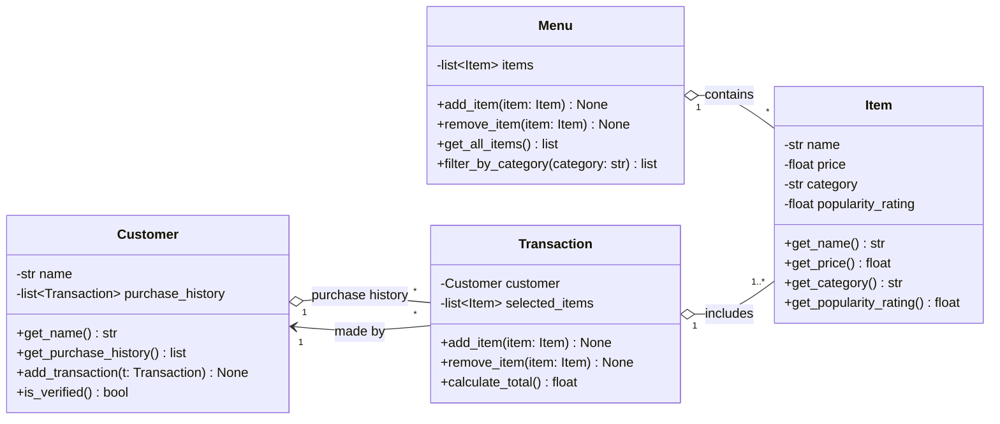

## Class Diagram
Paste into [mermaid.live](https://mermaid.live) to render.

## Design Notes
- **Category** is a plain string on `Item`, to stay within the four-class rule. `Menu.filter_by_category` handles case-insensitive matching.
- **Verification** is simple: `Customer.is_verified()` returns true when the customer has a name and at least one past transaction. No authentication logic.
- **Open question:** the spec has no quantity. For now, buying two burgers means adding the item twice. Worth confirming with the client.
- **Open question:** `Transaction` references live `Item` prices, so changing a price changes old totals. Consider copying the price at purchase time if that matters.
