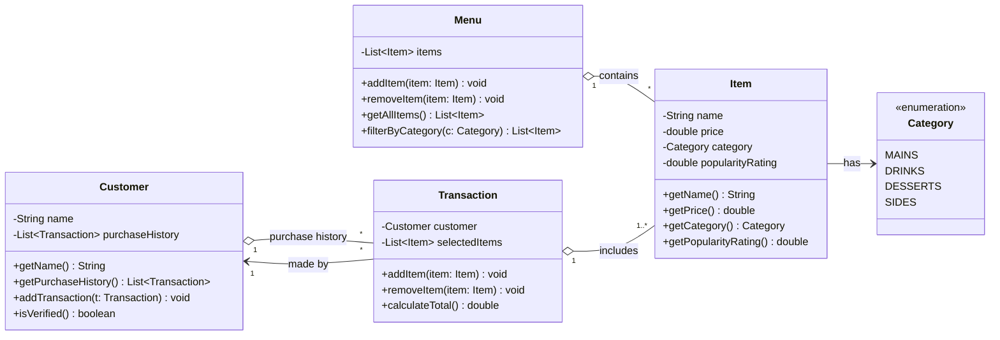

# ByteBites UML Class Diagram (Draft)

Paste the code below into [mermaid.live](https://mermaid.live) to render it.

```mermaid
classDiagram
    direction LR

    class Customer {
        -String name
        -List~Transaction~ purchaseHistory
        +getName() String
        +getPurchaseHistory() List~Transaction~
        +addTransaction(t: Transaction) void
        +isVerified() boolean
    }

    class Item {
        -String name
        -double price
        -Category category
        -double popularityRating
        +getName() String
        +getPrice() double
        +getCategory() Category
        +getPopularityRating() double
    }

    class Category {
        <<enumeration>>
        MAINS
        DRINKS
        DESSERTS
        SIDES
    }

    class Menu {
        -List~Item~ items
        +addItem(item: Item) void
        +removeItem(item: Item) void
        +getAllItems() List~Item~
        +filterByCategory(c: Category) List~Item~
    }

    class Transaction {
        -Customer customer
        -List~Item~ selectedItems
        +addItem(item: Item) void
        +removeItem(item: Item) void
        +calculateTotal() double
    }

    Menu "1" o-- "*" Item : contains
    Item --> Category : has
    Transaction "*" --> "1" Customer : made by
    Transaction "1" o-- "1..*" Item : includes
    Customer "1" o-- "*" Transaction : purchase history
```
